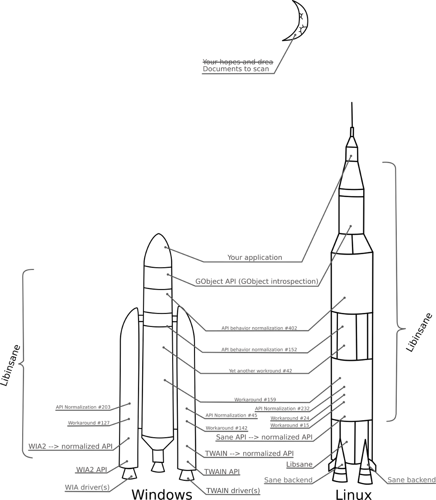

What is LibInsane ?
===================

LibInsane is a library allowing access to image scanners. It is the successor of
`Pyinsane`_.

* Cross-platform: Linux, \*BSD and Windows.
* Cross-API: `Sane`_ (Linux, \*BSD), `WIA2`_ (Windows), `TWAIN`_ (Windows).
* Cross-language: Thanks to `GObject introspection`_.
* Cross-scanner and cross-driver: Because a lot of them all have their quirks (and sometimes bugs).
* Cross-compiled: Windows version is built on a GNU/Linux system.

Let the insanity begin !

.. _Pyinsane: https://github.com/openpaperwork/pyinsane/
.. _Sane: http://sane-project.org/
.. _WIA2: https://msdn.microsoft.com/en-us/library/windows/desktop/ms630368(v=vs.85).aspx
.. _TWAIN: https://www.twain.org/
.. _GObject introspection: https://wiki.gnome.org/action/show/Projects/GObjectIntrospection?action=show&redirect=GObjectIntrospection

Global organisation
===================

